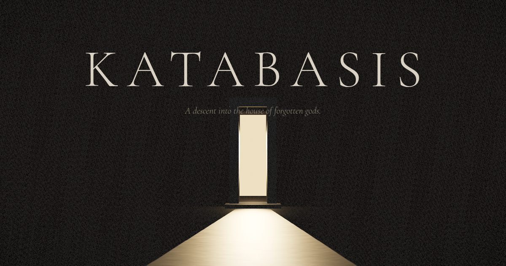

# KATABASIS — The House of Forgotten Gods

A digital monument in five rooms: a descent past one veiled figure, one
recovered wing, and one headless winged colossus beneath an oculus. Scroll is
the dolly; the building refuses to be rushed.



## The descent

| | Room | |
|---|---|---|
| I | **Threshold** | a blind monumental wall, one lit slit |
| II | **The Stair** | a slot of darkness, one blade of light |
| III | **The Veiled** | a single shrouded figure beneath a high window |
| IV | **The Wing** | a marble wing recovered without its figure |
| V | **The Winged One** | a headless colossus where the light comes down |
| VI | **Anabasis** | the way up |

## Run it

Everything is static — no build step, no bundler, no external requests.

```bash
# any static file server works (ES modules need http://, not file://)
python3 -m http.server 8000
# then open http://localhost:8000
```

## How it is made

- **Three.js** (vendored in `js/lib/`), one `<canvas>`, one post pass
  (ACES tone, gentle split grade, near-invisible grain, quiet vignette).
- **Every asset is procedural.** Aged-ivory marble and umber limestone are
  computed on a canvas; the veiled figures are radial drape fields
  (silhouette profile + fold harmonics) with cavity shading baked into
  vertex colors; the wings are parametric carved surfaces with scalloped
  trailing edges. No model files, no downloaded textures.
- **The camera is a shot list, not a tour.** Each room gets one slow,
  composed movement, then stillness; between shots the frame holds.
  Pointer parallax lets you look without leaving the path.
- **Light is the composition.** One motivated key per room — a doorway, a
  window, a slit, an oculus — with sparse dust that exists only where it
  crosses the light.
- **Sound is optional and synthesized** — a drone the depth of the building,
  breathing air, distant stone settling. Silence is the default.
- **Typography:** Cormorant Garamond & Inter, self-hosted (OFL).

## Access & performance

- `prefers-reduced-motion` honored; a manual **STILL** toggle does the same.
- All copy is real DOM text — screen-reader reachable, selectable, indexable.
- Keyboard: arrows / PageUp / PageDown / Home / End; navigation is focusable.
- Quality scales by device (pixel-ratio caps, geometry detail, dust counts)
  and degrades adaptively if the frame rate drops.
- Portrait screens are reframed — subjects sit high, copy owns the floor.
- No WebGL? A quiet fallback page keeps the door marked.
- `?probe` exposes `window.__KB` for deterministic visual testing.

MMXXVI. No stone was quarried.
